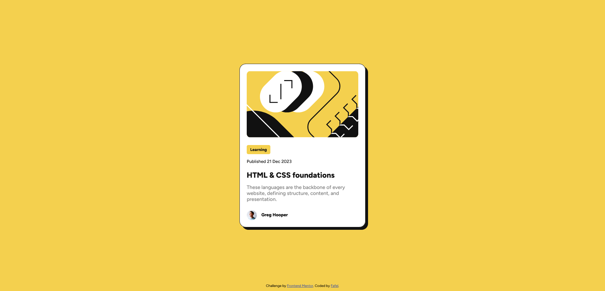
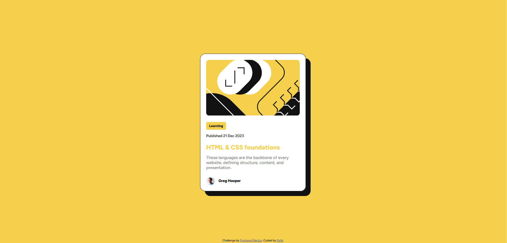

# Frontend Mentor - Blog preview card solution

## Welcome! 👋

This is a solution to the [Blog preview card challenge on Frontend Mentor](https://www.frontendmentor.io/challenges/blog-preview-card-ckPaj01IcS). Frontend Mentor challenges help you improve your coding skills by building realistic projects.

## Table of contents

- [Overview](#overview)
  - [The challenge](#the-challenge)
  - [Screenshot](#screenshot)
  - [Links](#links)
- [My process](#my-process)
  - [Built with](#built-with)
  - [What I learned](#what-i-learned)
  - [Continued development](#continued-development)
- [Author](#author)

## Overview

### The challenge

Users should be able to:

- See hover and focus states for all interactive elements on the page

### Screenshot

### Links

[Link_to_netlify](https://blog-preview-card-fafel.netlify.app/)

## My process

### Built with

- Semantic HTML5 markup
- Interactive website elements
- CSS custom properties
- Flexbox
- Mobile-first workflow

### What I learned

I learned how to create interactive elements on websites and practiced element styling in CSS3. By doing this exercise, I also learned how to implement projects based only on design preview, HTML5 and CSS3, basic of Git and GitHub, CSS custom properties.

### Continued development

 - I need to practice using Units and styling my images better
 - In the future, I plan to further deepen my knowledge of CSS3 by applying good practices in styling applications and websites.
 - I plan to learn SASS and JS and use them in future projects.

## Author

- Frontend Mentor - [@Fafel](https://www.frontendmentor.io/profile/Fafell)
- Twitter - [@Fafel](https://www.twitter.com/Fafffel)